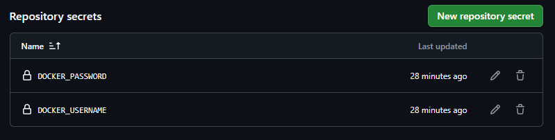

# Taller Docker Test - Reporte

Leidy Daniela Londoño Candelo - A00392917

## 📌 Descripción del Proyecto

Este proyecto es una aplicación en **React** que permite visualizar personajes de la serie **Rick and Morty** mediante una interfaz intuitiva.
La aplicación consume la **Rick and Morty API** para obtener información actualizada de los personajes.

---

## 🚀 Pasos de Configuración

### 🔹 PASO 1: Fork del Repositorio

1. Se realizo el fork del repositorio
4. Se clono para empezar a trabajar en el taller

---

### 🔹 PASO 2: Crear el Dockerfile

En la raíz del proyecto crea un archivo **Dockerfile**:

```dockerfile
FROM node:18-alpine as build

WORKDIR /app
COPY package*.json ./
RUN npm install
COPY . .
RUN npm run build

FROM nginx:alpine
COPY --from=build /app/build /usr/share/nginx/html
EXPOSE 80
CMD ["nginx", "-g", "daemon off;"]
```

---

### 🔹 PASO 3: Configurar GitHub Action

Cree la carpeta `.github/workflows/` y dentro el archivo **docker-build.yml**:

```yaml
name: Docker Build and Push

on:
  push:
    branches: [ main, master ]
  pull_request:
    branches: [ main, master ]

jobs:
  build-and-push:
    runs-on: ubuntu-latest

    steps:
      - name: Checkout code
        uses: actions/checkout@v3

      - name: Login to Docker Hub
        uses: docker/login-action@v2
        with:
          username: ${{ secrets.DOCKER_USERNAME }}
          password: ${{ secrets.DOCKER_PASSWORD }}

      - name: Build and Push
        uses: docker/build-push-action@v4
        with:
          context: .
          push: true
          tags: ${{ secrets.DOCKER_USERNAME }}/rick-morty-app:latest
```

---

### 🔹 PASO 4: Configurar Secretos en GitHub

1. En Docker Hub se creo un **Access Token** 

2. En el repositorio de GitHub se agregaron los secretos:

* `DOCKER_USERNAME`: tu usuario de Docker Hub.
* `DOCKER_PASSWORD`: el token generado.



---

### 🔹 PASO 5: Verificar el Build

1. Verificamos que el workflow se ejecute correctamente.


---

### 🔹 PASO 6: Verificar la Imagen en Docker Hub

1. Verificamos que la imagen se haya subido en Docker Hub.


---

### 🔹 PASO 7: Ejecución y visualización local


---

